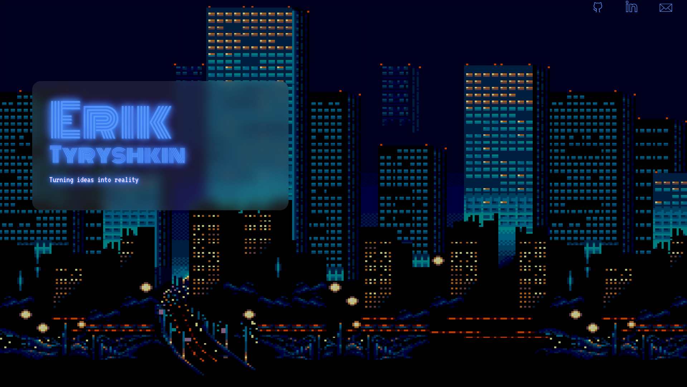

# personal-website
My simple portfolio site. Build with React.

## Website

Visit the site [here](https://eriktyryshkin.com/).

## Setup
1. Install `NodeJS` and `nvm`.
2. Change NodeJS to supported version via `nvm use`.
3. Build site with `npm run build`.
4. Launch locally via `npm run preview`.

## Deploying Site to Github Pages
To deploy the site to Github Pages, run `npm run deploy`.